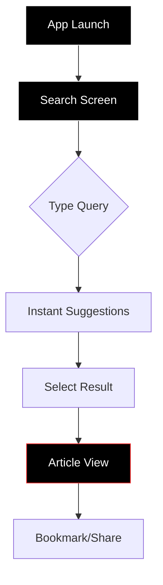
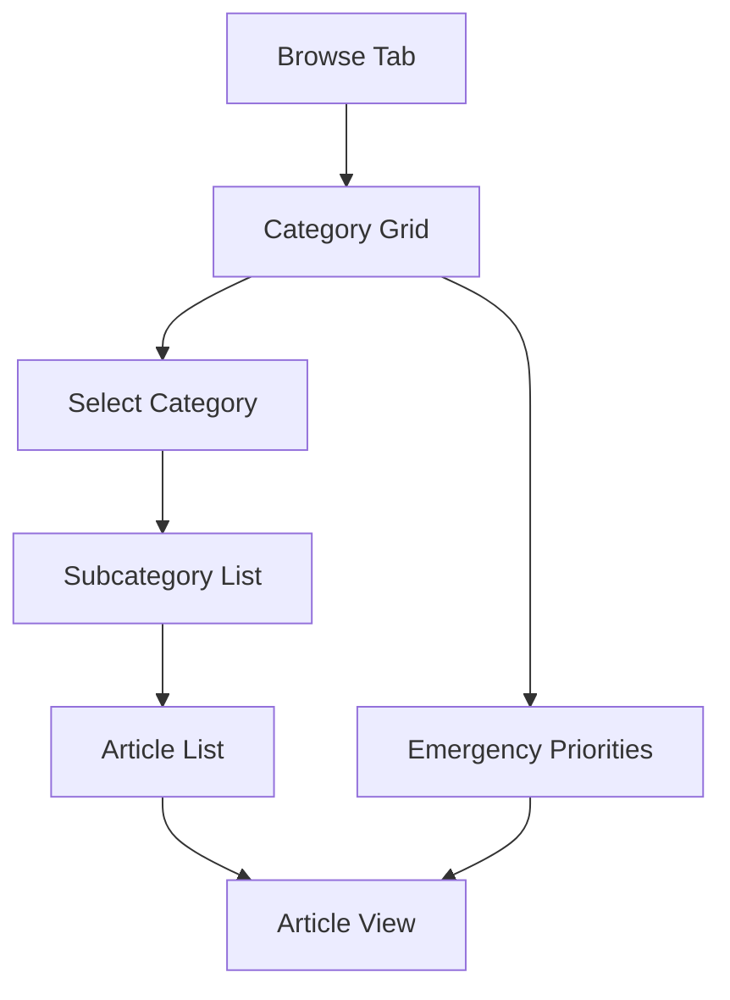
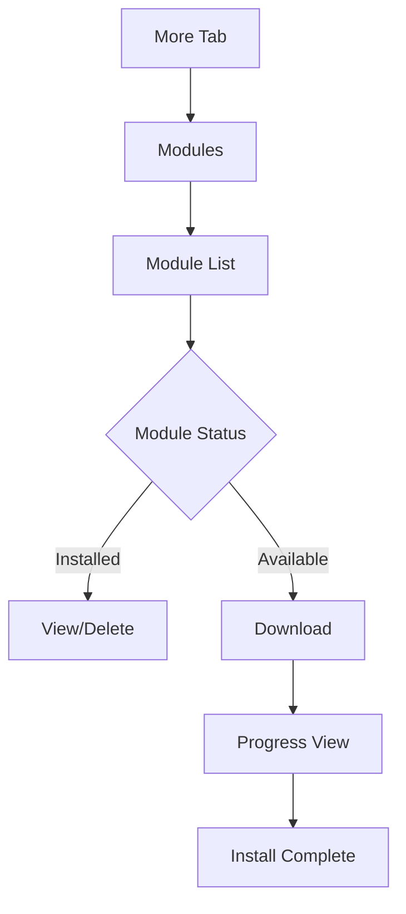

# Navigation Flow Documentation

## Overview
PrepperApp's navigation is designed for instant access to life-saving information under extreme stress. Every interaction is optimized for one-handed use, minimal cognitive load, and maximum speed.

## Core Navigation Principles

### 1. Search-First Architecture
- Search bar is ALWAYS visible
- No deeper than 2 taps to any content
- Voice search for hands-free operation
- Recent searches instantly accessible

### 2. Emergency Optimization
- Large touch targets (minimum 48x48dp)
- High contrast visual hierarchy
- No complex gestures required
- Works with gloves/wet hands

### 3. Predictable Patterns
- Consistent navigation across platforms
- Muscle memory development
- No hidden menus or features
- Clear visual feedback

## Information Architecture

### App Structure
```
PrepperApp/
├── Search (Primary)
├── Browse Categories
│   ├── Medical
│   ├── Water
│   ├── Shelter
│   ├── Fire
│   ├── Food
│   ├── Navigation
│   └── Signals
├── Bookmarks
├── Modules
└── Settings
```

### Navigation Hierarchy
```
Level 0: Search Bar (Always Visible)
    ↓
Level 1: Main Navigation (Bottom Tab Bar)
    ├── Search
    ├── Browse
    ├── Bookmarks
    └── More
    ↓
Level 2: Category/Content View
    ├── Category List
    ├── Article View
    └── Related Content
```

## Screen Flows

### Primary User Flow - Emergency Search


### Category Browsing Flow


### Module Management Flow


## Screen Designs

### Home/Search Screen
```
┌─────────────────────────────────────┐
│ 🔍 Search survival info...          │ ← Always visible
├─────────────────────────────────────┤
│                                     │
│ Recent Searches:                    │
│ ┌─────────────────────────────────┐│
│ │ 🕐 Tourniquet application       ││
│ └─────────────────────────────────┘│
│ ┌─────────────────────────────────┐│
│ │ 🕐 Water purification           ││
│ └─────────────────────────────────┘│
│                                     │
│ Critical Actions:                   │
│ ┌─────────────────────────────────┐│
│ │ 🩸 STOP BLEEDING                ││ ← Red background
│ └─────────────────────────────────┘│
│ ┌─────────────────────────────────┐│
│ │ 💧 FIND WATER                   ││
│ └─────────────────────────────────┘│
│                                     │
├─────────────────────────────────────┤
│ Search │ Browse │ Saved │ More     │ ← Fixed bottom
└─────────────────────────────────────┘
```

### Category Browse Screen
```
┌─────────────────────────────────────┐
│ 🔍 Search survival info...          │
├─────────────────────────────────────┤
│ Categories                          │
├─────────────────────────────────────┤
│ ┌───────────┐ ┌───────────┐        │
│ │    🩸     │ │    💧     │        │
│ │  MEDICAL  │ │   WATER   │        │
│ │  23 items │ │  15 items │        │
│ └───────────┘ └───────────┘        │
│                                     │
│ ┌───────────┐ ┌───────────┐        │
│ │    🏠     │ │    🔥     │        │
│ │  SHELTER  │ │   FIRE    │        │
│ │  18 items │ │  12 items │        │
│ └───────────┘ └───────────┘        │
│                                     │
│ ┌───────────┐ ┌───────────┐        │
│ │    🌿     │ │    🧭     │        │
│ │   FOOD    │ │NAVIGATION │        │
│ │  31 items │ │   9 items │        │
│ └───────────┘ └───────────┘        │
├─────────────────────────────────────┤
│ Search │ Browse │ Saved │ More     │
└─────────────────────────────────────┘
```

### Article View Screen
```
┌─────────────────────────────────────┐
│ ← Back          Treating Shock   🔖 │
├─────────────────────────────────────┤
│ ⏱ 3 min read    Priority: CRITICAL │
├─────────────────────────────────────┤
│                                     │
│ 1. Lay person flat                  │
│    [Diagram showing position]       │
│                                     │
│ 2. Elevate legs 12 inches          │
│    [Diagram showing elevation]      │
│                                     │
│ 3. Keep warm with blanket          │
│    • Do not overheat               │
│    • Monitor breathing              │
│                                     │
│ 4. Check pulse every 5 minutes     │
│    [Diagram showing pulse points]  │
│                                     │
│ ⚠️ GET MEDICAL HELP IMMEDIATELY    │
│                                     │
├─────────────────────────────────────┤
│ Related: CPR | Bleeding | Airways  │
└─────────────────────────────────────┘
```

## Navigation Components

### Search Bar Component
```swift
struct EmergencySearchBar {
    // Properties
    - Always visible at top
    - 56dp height minimum
    - Voice search button
    - Clear button when text present
    - Auto-complete dropdown
    
    // Behavior
    - Instant search as you type
    - Fuzzy matching enabled
    - Recent searches cached
    - Voice input for hands-free
}
```

### Bottom Navigation
```kotlin
class BottomNavigation {
    // Tabs
    - Search (home/default)
    - Browse (categories)
    - Saved (bookmarks)
    - More (settings/modules)
    
    // Design
    - 64dp height
    - Icon + label always visible
    - High contrast selection state
    - No animation on selection
}
```

### Category Cards
```css
.category-card {
    min-height: 120px;
    min-width: 160px;
    background: rgba(255, 255, 255, 0.05);
    border: 2px solid transparent;
    border-radius: 8px;
    padding: 16px;
    
    /* Touch feedback */
    &:active {
        background: rgba(255, 255, 255, 0.1);
        transform: scale(0.98);
    }
    
    /* Critical categories */
    &.critical {
        border-color: #FF3333;
        background: rgba(255, 51, 51, 0.1);
    }
}
```

## Gesture Support

### Supported Gestures
| Gesture | Action | Context |
|---------|--------|---------|
| Tap | Select/Open | All interactive elements |
| Swipe Right | Back/Dismiss | Article view, modals |
| Swipe Down | Refresh/Dismiss | Lists, search results |
| Long Press | Context menu | Articles (bookmark/share) |
| Pinch | Zoom text | Article view only |

### Accessibility Gestures
- **VoiceOver/TalkBack**: Full support
- **Switch Control**: All actions accessible
- **Voice Control**: Command shortcuts
- **Keyboard Navigation**: Tab order defined

## Platform-Specific Patterns

### iOS Navigation
```swift
// iOS-specific patterns
- Swipe from edge for back
- Large titles that collapse
- Search in navigation bar
- Haptic feedback on actions
- 3D Touch/Long press previews
```

### Android Navigation
```kotlin
// Android-specific patterns
- Back button/gesture support
- Material Design bottom nav
- FAB for critical actions
- Snackbar for feedback
- Navigation drawer (settings)
```

## State Management

### Navigation State
```typescript
interface NavigationState {
    currentScreen: Screen;
    searchQuery: string;
    selectedCategory: Category | null;
    articleHistory: Article[];
    bookmarks: string[];
    activeModules: Module[];
}

enum Screen {
    Search = "search",
    Browse = "browse",
    Article = "article",
    Bookmarks = "bookmarks",
    Settings = "settings"
}
```

### Deep Linking
```
prepperapp://search?q=bleeding
prepperapp://article/first-aid/bleeding-control
prepperapp://category/medical
prepperapp://module/advanced-medical
```

## Emergency Mode Navigation

### Activation
- Battery < 20%
- Triple-tap logo
- Settings toggle

### Changes in Emergency Mode
1. **Simplified Navigation**
   - Only Search and Browse tabs
   - No modules or settings
   - Critical content only

2. **Enhanced Touch Targets**
   - All buttons 64x64dp minimum
   - Increased spacing
   - Removed decorative elements

3. **Streamlined Content**
   - No images
   - Larger text
   - Critical procedures only

## Performance Requirements

### Navigation Metrics
| Action | Target | Maximum |
|--------|--------|---------|
| App launch to search | <1s | 2s |
| Search results | <200ms | 500ms |
| Screen transition | <100ms | 200ms |
| Category load | <150ms | 300ms |
| Article open | <100ms | 250ms |

### Memory Management
- Maximum 3 screens in back stack
- Aggressive view recycling
- Lazy loading for images
- Preload critical content only

## Testing Scenarios

### Stress Testing
1. **One-Handed Use**
   - All actions reachable with thumb
   - No precision required
   - Works while running/walking

2. **Impaired Conditions**
   - Wet screen functionality
   - Gloved hand operation
   - Bright sunlight visibility
   - Complete darkness use

3. **Panic Scenarios**
   - Shaking hands simulation
   - Time pressure testing
   - Cognitive load assessment
   - Error recovery paths

### Usability Metrics
- Task completion rate: >95%
- Error rate: <5%
- Time to critical info: <10 seconds
- Navigation clarity: 90% first-try success

## Future Enhancements

### Version 2.0
- Gesture shortcuts for critical actions
- Customizable quick actions
- Offline voice commands
- Haptic navigation patterns

### Version 3.0
- AR navigation overlay
- Predictive content loading
- Context-aware suggestions
- Mesh network content sharing